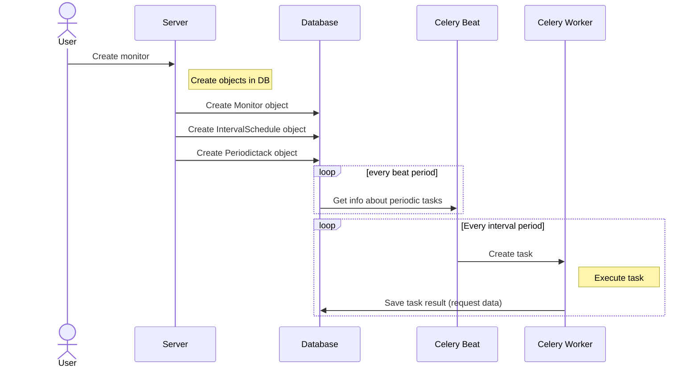

# Dynamically update periodic tasks in Celery and Django

Example project showing how to dynamically add and remove periodic tasks in Celery and Django. It is using `PeriodicTask` class from [**`django-celery-beat`**](https://github.com/celery/django-celery-beat) package.

This example repository is very simple demo of [uptime monitoring service](https://monitor-uptime.com). User can add server address and interval at which server uptime status will be checked. Tasks can be dynamically added or removed.

You can read more about [dynamic periodic tasks in the article](https://saasitive.com/tutorial/dynamically-update-periodic-tasks-celery/).

## Sequence diagram of uptime monitoring 

